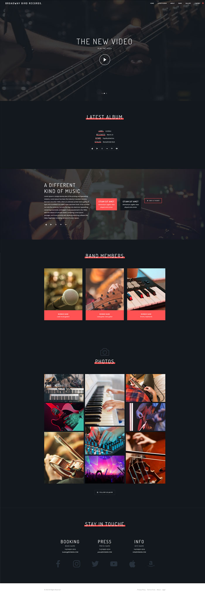

# Broadway Bird Records Website

A responsive website created for Broadway Bird Records as part of my internship work at UIW. This project showcases a visually engaging design and highlights the various features of the music label. The website is built using HTML, CSS, Bootstrap, JavaScript, and FlexSlider.

## Features

1. **One-Page Design**: The website offers a seamless user experience with a single-page layout, making it easy to navigate and find information quickly.
2. **Technologies Used**: HTML, CSS, Bootstrap, JavaScript, and FlexSlider have been utilized to create a modern, responsive, and user-friendly website.
3. **Favicon**: A favicon has been added to provide a recognizable icon in browser tabs and bookmarks.
4. **Image Gallery**: The website features a visually appealing gallery, showcasing multiple images related to Broadway Bird Records and their artists.
5. **Responsive Design**: The website is fully responsive, providing an optimal user experience across various devices, including mobile phones.

